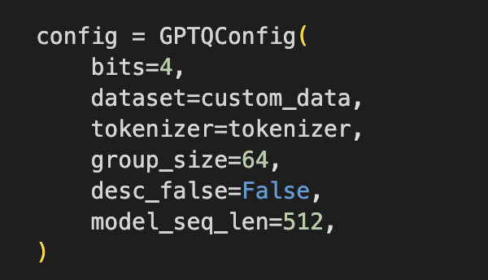

# Quantization Techniques for LLMs

### **GPTQ (Generalized Post-Training Quantization):** GPTQ is designed to perform post-training quantization on large pre-trained models. It focuses on making models more efficient by reducing the precision of weights after the model is already trained, without the need for retraining.

- **Advantages**:
  - Simpler to implement, as it doesn't require re-training or fine-tuning of the model.
  - Well-suited for large-scale deployment, where post-processing the model is often the preferred method.
  - Generally shows good performance for LLMs, maintaining accuracy after the quantization process.
- **Disadvantages**:
  - May not achieve as high accuracy retention as more advanced or adaptive methods, especially if the model is very large or complex.
     
### **AWQ (Adaptive Weight Quantization):** AWQ adjusts the quantization scheme based on the specific characteristics of the model weights, focusing on reducing the bit-width of the weights without significantly impacting performance. It aims to find the optimal trade-off between model size reduction and accuracy retention.

- **Advantages**:
  - Typically provides a good balance between model compression and maintaining accuracy.
  - More adaptive to different models, which can lead to more efficient weight representation.
- **Disadvantages**:
  - Can be more complex to implement, as it requires fine-tuning of the quantization process for specific models.
  - May require additional steps in optimization and tuning for best results.

 **GTPQ Example configuration:**

 

 **Model Configuration:**

 
 

